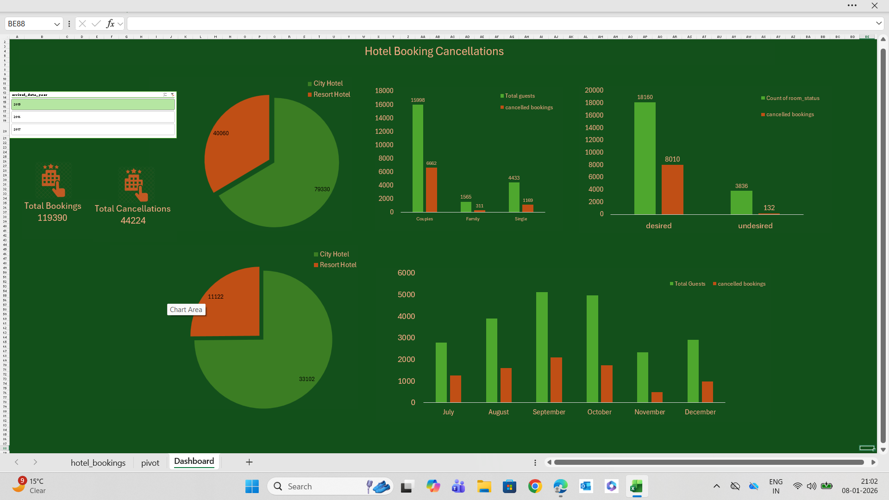

# Hotel Booking Cancellation Dashboard (Excel)

## 📌 Project Overview
This project is an interactive Excel dashboard designed to analyze hotel booking and cancellation data.
The dashboard provides clear insights into booking patterns, guest behavior, hotel types, and seasonal trends,
helping stakeholders understand factors affecting cancellations.

## 🎯 Objectives
- Analyze total bookings and cancellation rates
- Compare City Hotel and Resort Hotel performance
- Understand guest-type behavior (Couples, Family, Single)
- Identify monthly and seasonal cancellation trends
- Analyze desired vs undesired room allocation

## 📊 Key Insights
- Higher cancellation rates observed in City Hotels compared to Resort Hotels
- Couples contribute the highest number of bookings and cancellations
- Peak cancellations occur during specific months indicating seasonality
- Desired room bookings show significantly lower cancellation rates

## 🛠 Tools & Techniques Used
- Microsoft Excel
- Pivot Tables and Pivot Charts
- Slicers for interactive filtering
- Conditional Formatting
- KPI Cards
- Data Cleaning and Data Analysis

## 📈 Dashboard Features
- Interactive year-wise filtering using slicers
- KPI cards for total bookings and total cancellations
- Multiple charts for hotel type, guest type, and monthly analysis
- Clean, visually appealing, and user-friendly layout

## 🖼 Dashboard Preview

## 📂 Files Included
- `Hotel_Booking_Dashboard.xlsx` – Excel dashboard file  
- `Dashboard.png` – Dashboard screenshot  
- `hotel_bookings.csv` – Dataset used  
- `README.md` – Project documentation  

## 💡 Learnings
- Improved hands-on skills in Excel data analysis
- Practical experience with dashboard design and storytelling
- Better understanding of business-oriented data visualization

## 👩‍💻 Author
**Monika Chouhan**
